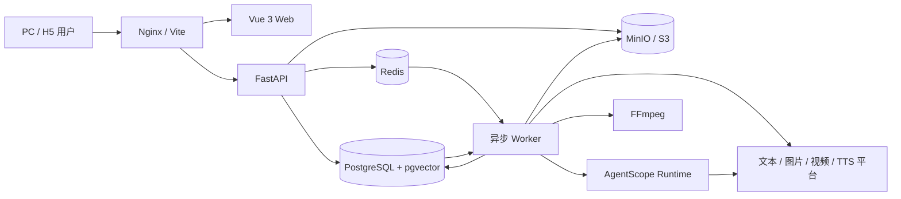

# CineForge AI 短剧制作平台

## 启动方式

### 方式一：Docker Compose 完整启动（推荐）

这是最接近正式环境的启动方式，会同时运行 PostgreSQL、pgvector、Redis、MinIO、AgentScope Runtime、FastAPI、异步 Worker、Vue Web 和 Nginx。

环境要求：

- Docker Engine 或 Docker Desktop
- Docker Compose v2
- 建议至少 4 核 CPU、8 GB 内存和足够的媒体文件存储空间

首次启动：

```powershell
Copy-Item .env.example .env
```

打开 `.env`，至少替换以下生产敏感配置：

- `POSTGRES_PASSWORD`
- `JWT_SECRET`
- `CREDENTIAL_ENCRYPTION_SECRET`
- `AGENT_RUNTIME_INTERNAL_TOKEN`
- `S3_SECRET_ACCESS_KEY`
- `MEDIA_SIGNING_SECRET`

然后构建并启动：

```powershell
docker compose up -d --build
docker compose ps
```

默认访问地址：

- Web：<http://127.0.0.1:8080>
- 健康检查：<http://127.0.0.1:8080/health>

查看核心服务日志：

```powershell
docker compose logs -f api worker agent-runtime web
```

停止服务但保留数据库和媒体卷：

```powershell
docker compose down
```

> `docker compose down -v` 会删除 PostgreSQL、Redis、MinIO、Skills 和 Runtime 状态卷。除非确认不需要数据，否则不要执行。

当 `SEED_DEMO_DATA=true` 时，可以使用演示账号：

| 角色 | 租户 | 账号 | 密码 |
| --- | --- | --- | --- |
| 管理员 | `demo` | `admin@cineforge.local` | `Admin123!` |
| 创作者 | `demo` | `creator@cineforge.local` | `Creator123!` |

正式部署应设置 `SEED_DEMO_DATA=false`，并通过安全方式创建首个租户管理员。

### 方式二：Windows 本地开发启动

环境要求：

- Python 3.12+
- Node.js 22+
- pnpm 11.7+
- FFmpeg（章节成片渲染需要，命令 `ffmpeg` 必须在 `PATH` 中）

安装依赖：

```powershell
py -3.12 -m venv .venv
.venv\Scripts\python.exe -m pip install --upgrade pip
.venv\Scripts\python.exe -m pip install -e "apps/api[dev,postgres,s3]"
.venv\Scripts\python.exe -m pip install -e "services/agent-runtime/agentscope[dev]"
corepack enable
corepack prepare pnpm@11.7.0 --activate
pnpm install --frozen-lockfile
```

分别打开四个终端，从仓库根目录执行。

终端 1，启动 AgentScope Runtime：

```powershell
Set-Location services/agent-runtime/agentscope
..\..\..\.venv\Scripts\python.exe -m uvicorn runtime.main:app --host 127.0.0.1 --port 8010
```

终端 2，启动 FastAPI：

```powershell
.venv\Scripts\python.exe -m uvicorn app.main:app --app-dir apps/api --host 0.0.0.0 --port 8000
```

终端 3，启动持久化任务 Worker：

```powershell
Set-Location apps/api
..\..\.venv\Scripts\python.exe -m app.worker
```

终端 4，启动 Vue Web：

```powershell
pnpm dev:web
```

本地访问地址：

- Web：<http://127.0.0.1:5173>
- 局域网 Web：`http://<本机局域网 IP>:5173`
- API：<http://127.0.0.1:8000>
- API 文档：<http://127.0.0.1:8000/docs>
- Agent Runtime：<http://127.0.0.1:8010/health>

Vite 默认监听 `0.0.0.0:5173`，并把 `/api`、`/health`、`/uploads` 代理到 `VITE_API_PROXY`，默认值为 `http://127.0.0.1:8000`。

本地开发未设置 `DATABASE_URL` 时使用仓库根目录的 `cineforge.db`（SQLite），未设置 `REDIS_URL` 时 Worker 会轮询数据库。多人协作、并发恢复、pgvector 和正式部署必须使用 PostgreSQL + Redis，推荐直接使用 Docker Compose。

### 修改后需要重启哪些服务

| 修改范围 | 需要重启 |
| --- | --- |
| `apps/web/src/` | Vite 通常自动热更新 |
| `apps/api/app/api/`、`core/`、`db/` | API |
| `apps/api/app/services/`、`worker.py` | Worker；若 API 也导入了相关模块则一并重启 API |
| `services/agent-runtime/agentscope/` | Agent Runtime |
| 数据库迁移 | 先执行迁移，再重启 API 和 Worker |
| `.env` | 所有读取了对应变量的服务 |

API、Worker 和 Runtime 都不会自动热重载。只修改代码但不重启进程，会继续运行旧逻辑。

## 项目简介

CineForge 是一套面向 PC 与 H5 的多租户 AI 短剧生产平台。系统覆盖邀请注册、项目创建、原文导入、章节分析、剧本改编与审核、资产提取与生图、分镜、视频、台词配音、章节合成、Agent 对话、Skills、技能/模板/素材广场、记忆、积分和任务通知。

平台采用“业务后端负责权威状态，Agent 负责理解与编排，Worker 负责持久任务，媒体网关负责模型调用”的边界设计。AI 对话不会直接绕过业务规则修改数据库或调用媒体供应商，而是通过受控工具和平台 API 创建可审计、可计费、可重试的任务。

详细产品需求见 [REQUIREMENTS.md](REQUIREMENTS.md)，更深入的系统设计见 [docs/ARCHITECTURE.md](docs/ARCHITECTURE.md)。

## 技术栈

### Web 前端

| 技术 | 用途 |
| --- | --- |
| Vue 3.5 + Composition API | 页面与业务组件 |
| TypeScript 5.9 | 类型约束 |
| Vite 8 | 开发服务器与生产构建 |
| vite-plugin-pwa + Workbox | 可安装 PWA、离线应用壳和 Service Worker 自动更新 |
| Vue Router 4 | 登录、创作台、Skills、导演台和管理后台路由 |
| Pinia 3 | 登录、项目、任务通知和 Toast 状态 |
| Reka UI | 可访问的高级交互基础组件 |
| Lucide Vue | 图标体系 |
| GSAP 3.15 | 页面动画、流式输出与微交互 |
| TanStack Vue Virtual | AI 长对话虚拟滚动 |
| markdown-it | Agent Markdown 实时渲染 |
| QRCode | 在浏览器本地生成邀请注册链接二维码 |
| 原生 SSE + Fetch | 用户级任务事件和 Agent 流式内容 |

### Python 核心后端

| 技术 | 用途 |
| --- | --- |
| Python 3.12 | API 和 Worker 运行时 |
| FastAPI | 异步 REST API、鉴权依赖和 SSE |
| Uvicorn | ASGI 服务 |
| SQLAlchemy 2 Async | 异步 ORM、事务、行锁和租户过滤 |
| Alembic | PostgreSQL 生产迁移 |
| Pydantic / pydantic-settings | API Schema 与环境配置 |
| httpx AsyncClient | Agent Runtime 与模型平台异步请求 |
| PyJWT | JWT 访问令牌 |
| cryptography | 模型平台 API Key 加密保存 |
| Pillow | 图片验证、转换和缩略处理 |
| EbookLib + BeautifulSoup | EPUB/TXT 章节解析 |
| pytest + pytest-asyncio + Ruff | 自动化测试和代码检查 |

### 数据、队列与媒体

| 技术 | 用途 |
| --- | --- |
| PostgreSQL 16 | 多租户业务数据、任务、积分、通知和审计的权威存储 |
| pgvector | Agent 记忆向量检索；当前为 384 维向量 |
| SQLite + aiosqlite | 单机开发和测试，不作为生产数据库 |
| Redis 7 + hiredis | 队列唤醒、用户事件 Pub/Sub 和登录限流 |
| MinIO / S3 | 上传文件、图片、视频、音频和成片对象存储 |
| FFmpeg | 章节视频与音频合成 |

### Agent 与模型平台

| 技术 | 用途 |
| --- | --- |
| AgentScope `2.0.7.post1` | ReAct Agent、工具调用、状态快照和运行事件 |
| 独立 Runtime 协议 `v2` | 核心后端与 AgentScope 的稳定隔离层 |
| OpenAI 兼容协议 | 文本、图片、视频、TTS 模型接入基础 |
| Sub2API / NewAPI / Custom | 内置供应商类型与自定义适配器 |
| Skills + Prompt Templates | 视觉手册、导演手册、系统提示词和用户技能 |

### 部署

| 技术 | 用途 |
| --- | --- |
| Docker Compose | 本地完整栈和单机部署 |
| Nginx 1.27 | Vue 静态资源、API、媒体与 SSE 反向代理 |
| Docker named volumes | PostgreSQL、Redis、MinIO、Skills 和 Runtime 持久化 |

## 系统架构



组件职责：

- **Vue Web**：用户创作体验、管理员配置、流式反馈和任务中心。
- **FastAPI**：多租户、RBAC、JWT、项目、资产、模型配置、积分、任务提交和结果查询。
- **PostgreSQL**：所有业务状态的唯一权威来源，Redis 不能替代数据库。
- **Redis**：加速队列消费和实时事件；Redis 不可用时任务仍保存在数据库中。
- **Worker**：异步领取任务、供应商并发控制、租约心跳、失败退款、恢复和结果持久化。
- **AgentScope Runtime**：只负责 Agent 推理、Skills、受控文件工具、上下文和运行状态，不负责租户、积分或媒体任务状态。
- **媒体网关**：统一调用图片、视频与 TTS 服务，支持同步结果和异步服务商任务 ID。
- **对象存储**：保存原文、封面、资产图、参考图、视频、音频和章节成片。

## 目录结构

```text
CineForge/
├─ apps/
│  ├─ web/                         Vue 3 前端
│  │  ├─ src/components/          通用组件和大型业务工作台组件
│  │  ├─ src/views/               登录、创作台、导演台、Skills、资源广场、管理后台
│  │  ├─ src/stores/              Pinia 状态
│  │  ├─ src/lib/                 API、Markdown、动画、流式打字机
│  │  ├─ src/router.ts             前端路由和权限守卫
│  │  ├─ src/types.ts              前端业务类型
│  │  ├─ src/styles.css            全局设计系统和响应式样式
│  │  ├─ vite.config.ts            开发服务器与 API 代理
│  │  ├─ nginx.conf                生产反向代理
│  │  └─ Dockerfile                Web 构建镜像
│  └─ api/                         FastAPI 和 Worker
│     ├─ app/api/routes/           REST/SSE 路由
│     ├─ app/core/                 配置、JWT、密码和加密
│     ├─ app/db/                   ORM、会话、种子数据、迁移保护
│     ├─ app/domain/               Pydantic 请求与响应模型
│     ├─ app/services/             Agent、任务、媒体、计费和工作流服务
│     ├─ app/main.py               API 入口
│     ├─ app/worker.py             多执行槽 Worker 入口
│     ├─ migrations/               Alembic 迁移
│     ├─ skills/                   初始演示手册包
│     ├─ tests/                    API、Worker、迁移和存储测试
│     └─ Dockerfile                API/Worker 共用镜像
├─ services/
│  └─ agent-runtime/
│     ├─ agentscope/               当前正式 AgentScope Runtime
│     │  ├─ runtime/               协议、适配器、上下文、路径保护
│     │  ├─ tests/                 Runtime 契约与隔离测试
│     │  ├─ README.md              Runtime 专项说明
│     │  └─ UPGRADING.md           AgentScope 独立升级流程
│     └─ deepseek-harness/         历史兼容实现，不是当前启动目标
├─ skills/tenants/                 按租户持久化的系统 Skills 和手册
├─ uploads/                        本地开发对象存储与媒体缓存
├─ runtime-data/                   本地 Runtime 状态、工作区和日志
├─ docs/ARCHITECTURE.md            深入架构、恢复和安全设计
├─ REQUIREMENTS.md                 产品需求基线
├─ docker-compose.yml              完整服务编排
├─ .env.example                    Compose 环境变量模板
├─ package.json                    根目录脚本
└─ pnpm-workspace.yaml             pnpm 工作区
```

### Web 主要组件

| 文件 | 职责 |
| --- | --- |
| `AppShell.vue` | 桌面侧栏、移动导航、账号菜单和消息中心入口 |
| `AgentChatPanel.vue` | 首页/导演台 Agent 对话、附件、流式输出、会话和模式切换 |
| `AgentExecutionPanel.vue` | 模型与工具调用状态 |
| `DirectorAgentWorkflowCard.vue` | 导演子智能体与审核决策卡片 |
| `DirectorChapterCanvas.vue` | 导演台章节创作区域 |
| `AssetLibraryWorkbench.vue` | 项目/全局资产、衍生关系、提示词、上传和生图 |
| `ChapterFinishingPanel.vue` | 台词、音频、时间线和章节成片 |
| `ActivityCenter.vue` | 用户隔离的任务与通知中心 |
| `AdminUsersPanel.vue` | 管理员用户、状态、密码和积分管理 |
| `VideoCapabilityEditor.vue` | 视频模型能力与参数编辑 |
| `SkillTree.vue` | 管理员 Skills 文件树和编辑器 |
| `MarketplaceView.vue` | 技能、模板和素材广场，共享、复制、同步与私人模板管理 |

### API 路由模块

| 模块 | 职责 |
| --- | --- |
| `auth.py` | 登录、刷新、注销、当前用户 |
| `projects.py` | 项目、配置、封面、删除 |
| `agent_chat.py` | 项目 Agent、个人 Agent、会话、附件和媒体模式 |
| `director.py` | 项目文件、章节、分析和剧本 |
| `director_workflows.py` | 剧本/分镜编排、子智能体、审核和用户决策 |
| `assets.py` | 项目/全局资产、衍生资产、版本、上传和生成任务 |
| `storyboards.py` | 分镜版本、镜头、提示词和视频任务 |
| `dubbing.py` | 台词、音色绑定、TTS 和音频版本 |
| `finishing.py` | 音轨、合成清单和 FFmpeg 成片任务 |
| `tasks.py` / `notifications.py` | 任务、事件、取消、重试、通知和 SSE |
| `memories.py` | Agent 记忆查询 |
| `user_skills.py` | 用户级 Skill 增删改查和启停 |
| `marketplace.py` | 三类资源广场、私人模板、发布快照、复制和版本同步 |
| `admin.py` | 用户、积分、供应商、模型、Agent、手册、提示词和计费规则 |
| `skills.py` | 管理员 Skills 文件树与文件保存 |

### 后端服务模块

| 模块 | 职责 |
| --- | --- |
| `task_submission.py` | 同事务扣费、任务创建、价格快照和入队 |
| `task_worker.py` | 所有持久任务执行、租约、恢复、Agent 流和媒体结果 |
| `task_queue.py` | Redis 队列和用户事件，失败时允许数据库降级 |
| `task_events.py` | 任务进度与状态事件 |
| `billing.py` | 积分账户、不可变流水、扣费和退款 |
| `provider_adapters.py` | Sub2API、NewAPI、OpenAI 兼容和自定义供应商适配 |
| `media_gateway.py` | 图片、视频、TTS 的统一请求与轮询 |
| `agent_runtime.py` | 调用私有 AgentScope Runtime |
| `agent_memory.py` | 记忆提炼、向量化和按需召回 |
| `director_orchestration.py` | 主 Agent、一次性子智能体、审核与流程推进 |
| `managed_skills.py` / `user_skills.py` | 固定 Skills、手册和用户 Skills |
| `object_storage.py` | 本地文件与 S3/MinIO 双实现 |
| `source_import.py` | TXT、EPUB 和粘贴文本章节识别 |
| `composition_renderer.py` | 异步 FFmpeg 渲染 |

## 核心功能

### 多租户、用户与权限

- 所有用户、项目、模型、任务、资产、积分和通知按租户隔离。
- 普通用户只能使用管理员配置，不能进入管理后台。
- 管理员可以创建用户、编辑显示名、角色和状态、重置密码。
- 不允许管理员禁用或降级自己，也不允许移除租户最后一个有效管理员。
- 用户采用停用而不是物理删除，保留项目、任务、积分和审计历史。
- JWT 使用短期访问令牌和 HttpOnly 刷新令牌，支持轮换、注销吊销和重放检测。
- 登录保护包含 Redis IP 限流、PostgreSQL 账号失败计数和安全审计。

### 模型平台与默认模型

- 支持 Sub2API、NewAPI、OpenAI 兼容和自定义供应商。
- 支持平台新增、编辑、删除、连通性测试、模型自动发现和批量导入。
- 模型分为文本、图片、视频和 TTS 四类。
- 每个供应商可以配置 `1-64` 个并发工作流；达到限制后任务继续排队。
- **默认文本、默认视频模型以及 1K、2K、4K 三档图片模型路由必须全部配置并启用；默认 TTS 可选。**
- 每档图片分辨率可独立选择任意已启用供应商下的指定图片模型；封面、资产和首页生图任务按请求分辨率自动路由。
- Agent 可单独绑定文本模型，未绑定时回退到租户默认文本模型。
- 首页“生成图片”不是只调用图片模型：先由文本模型理解对话并生成最终提示词，再按所选分辨率调用对应图片模型。
- 首页“生成视频”同样先由文本模型整理视频提示词，再调用默认视频模型。
- 供应商 API Key 使用平台加密密钥加密保存，不在普通 API 中明文返回。

### 创作台与个人 Agent

- 用户只看到自己的短剧项目，可以创建、编辑和删除项目。
- 项目配置包含画风/导演手册、视频模型参数、比例与图片分辨率；底层图片平台和模型由管理员统一路由。
- 项目封面支持默认图、用户上传和积分生图。
- 首页个人 Agent 每次刷新默认开启新会话，历史会话可选择和删除。
- 支持对话、生成图片、生成视频和创作 Skill 四种模式。
- 支持上传图片和 `Ctrl+V` 粘贴图片。
- 支持输入 `/` 检索并显式调用一个或多个用户 Skill。
- 长对话使用虚拟滚动；流式内容使用平滑打字机和实时 Markdown。
- 个人 Agent 不绑定项目，不能读写任何项目内容。
- Web 支持安装到 Windows、macOS、Android 桌面或移动设备主屏幕，并以独立应用窗口运行；iOS 通过 Safari“添加到主屏幕”完成安装。
- 移动端锁定页面缩放，保留正常纵向、横向滚动以及安全区适配，避免双击或手势误缩放创作工作区。

> PWA 的 Service Worker 和原生安装提示要求安全上下文。正式域名必须启用 HTTPS；开发时 `localhost` 可用，局域网 IP 的裸 HTTP 只能作为普通网页访问。

### 导演台生产流程

- 支持上传 TXT/EPUB 或直接粘贴小说、剧本，并自动识别章节。
- 每个项目拥有可下载、可新增、编辑和删除的项目文件库。
- 章节支持分析、剧本生成、多版本、审核轨迹和生效版本。
- 剧本切换会使下游资产提取、分镜、音频和成片按依赖规则失效。
- 主 Agent 负责用户沟通与流程推进；每个重复或专门任务创建独立子智能体。
- 子智能体任务一对一保存状态和记录，失败可按规则重试。
- 审核不通过时生成固定选项，等待用户选择局部修复、整体重做或继续。
- 剧本审核通过后可自动触发资产提取；分镜前会验证所需资产图片是否存在。

### 资产、分镜、视频和音频

- 项目“塑造资产”可被当前项目 Agent 读取；租户全局资产库用于人工复用。
- 资产包括人物、场景、道具、素材和音频。
- 人物、场景、道具支持一级衍生资产及清晰的父子关系。
- 支持资产手工创建、AI 提取、手工提示词、AI 提示词、图片上传和生图。
- 提示词生成和图片生成是独立持久任务，可单项或批量执行。
- 分镜按版本保存，镜头包含时长、动作、运镜、台词、资产引用和参考图。
- 视频提示词读取当前镜头、资产图片、视觉手册和视频提示词 Skill。
- 支持文生视频、首帧/参考图视频以及供应商自定义能力参数。
- 台词按版本提取，人物资产可绑定 TTS 模型和音色。
- 章节合成冻结分镜、视频、音频、配乐、环境音和输出参数，通过 FFmpeg 生成 MP4。

### Agent 记忆与上下文

- 自动提炼长期记忆，并按租户、用户、项目和命名空间隔离。
- PostgreSQL + pgvector 保存记忆向量，按查询相似度和重要性进行召回。
- 当前嵌入实现为 `cineforge-hash-v1`、384 维，可替换为外部嵌入模型。
- 会话持续生成跨轮摘要，长历史按消息数和字符预算压缩。
- 项目大文件使用指针和按需读取，不在每轮对话重复发送全部正文。
- AgentScope 状态用于执行恢复，PostgreSQL 会话、摘要和记忆始终是权威来源。

### Skills 与提示词

- 管理员维护系统提示词、视觉手册、导演手册和底层 Skills 文件。
- 系统提示词只允许编辑固定功能项，不允许随意新增或删除。
- 视觉手册具有固定必填文件：总说明、前缀、角色、角色衍生、道具、道具衍生、场景、场景衍生、分镜、分镜视频和技法文件。
- 导演手册具有固定必填文件：`README.md`、导演规划和分镜表。
- 用户 Skills 可以创建、编辑、删除、启用和禁用，并绑定剧本、审核、资产、分镜或视频等触发阶段。
- Agent 只检索当前阶段启用 Skill 的说明，再按需加载一个或多个 Skill，不会无条件注入全部文件。
- 管理员 Skills 文件访问受根目录路径保护，不能越界访问系统文件。

### 技能、模板与素材广场

- 所有登录用户都可以从顶部或 H5 导航进入技能广场、模板广场和素材广场。
- 用户可以把自己的 Skill 发布到技能广场，也可以再次发布修改后的新版本；其他用户一键复制到“我的 Skills”。
- 用户可以创建和维护私人文本模板，发布到模板广场；复制后的模板可以继续独立编辑。
- 用户可以把自己创建的全局资产发布到素材广场；其他用户一键导入到本人所属租户的全局资产库。
- 广场保存发布时的公开快照，不直接读取或暴露发布者的私人源对象。跨租户只共享用户主动发布的内容。
- 复制产生归当前用户所有的独立副本，作者后续编辑不会静默覆盖副本；作者重新发布后，使用者会看到新版提示并主动同步。
- 删除源 Skill、私人模板或源全局资产会自动下架对应广场条目；其他用户已经复制的副本不会被删除。

### 持久任务、消息与积分

- Agent、提示词、图片、视频、TTS 和成片统一进入持久任务系统。
- 状态包含排队中、进行中、已完成、失败和已取消，并保存真实进度与事件时间线。
- PostgreSQL 保存任务真值；Redis 只负责低延迟唤醒和事件传播。
- Worker 使用可配置异步执行槽，默认 `WORKER_CONCURRENCY=8`。
- Worker 领取任务时写入身份、心跳和租约，过期任务可被其它 Worker 安全恢复。
- 异步媒体供应商任务 ID 会先持久化，Worker 重启后继续轮询而不是重复提交。
- 无法确认上游结果的同步任务在 Worker 中断后会明确失败并退款，不会永久卡在进行中。
- Agent 对话默认只在连续 300 秒没有任何响应或进度时中断；正常流式输出会刷新空闲计时。
- 任务创建与积分扣减在同一数据库事务中完成，并冻结单价、数量、总价和规则版本。
- 失败与取消退款使用原始价格快照，且同一任务只能退款一次。
- 积分流水不可变，管理员手工增减积分同样记录流水和安全审计。
- SSE 只向当前登录用户推送自己的任务与通知，前端同时低频对账 PostgreSQL。

## 数据目录与持久化

### Docker 卷

| 卷 | 内容 |
| --- | --- |
| `postgres_data` | PostgreSQL 和 pgvector 数据 |
| `redis_data` | Redis AOF |
| `object_storage_data` | MinIO 对象 |
| `uploads_data` | API/Worker 媒体缓存 |
| `skills_data` | 租户 Skills 和手册文件 |
| `agent_runtime_data` | AgentScope 会话状态和任务工作区 |

### 本地目录

- `cineforge.db`：默认 SQLite 开发数据库。
- `uploads/`：本地对象存储和媒体缓存。
- `skills/tenants/<tenant-id>/`：租户系统提示词、视觉手册和导演手册。
- `runtime-data/states/`：Runtime 状态。
- `runtime-data/workspaces/`：Agent 受控工作区。
- `runtime-data/logs/` 及根目录 `*.log`：本地运行日志。

这些目录属于运行数据，默认不会提交到 Git。服务运行期间优先通过后台和 API 修改 Skills，不要同时手工覆盖文件。

## 环境变量

主要配置项如下，完整 Compose 示例见 [.env.example](.env.example)。

| 变量 | 默认值/说明 |
| --- | --- |
| `APP_ENV` | `development`；生产为 `production` |
| `DATABASE_URL` | 本地默认 SQLite；生产使用 `postgresql+asyncpg://...` |
| `REDIS_URL` | Redis 地址；为空时退化为数据库轮询 |
| `JWT_SECRET` | JWT 签名密钥，生产必须替换 |
| `CREDENTIAL_ENCRYPTION_SECRET` | 供应商凭据加密密钥，变更前必须规划密钥迁移 |
| `CORS_ORIGINS` | 允许访问 API 的前端 Origin JSON 数组 |
| `SKILLS_ROOT` | Skills 根目录 |
| `UPLOADS_ROOT` | 本地媒体缓存目录 |
| `STORAGE_BACKEND` | `local` 或 `s3` |
| `S3_ENDPOINT_URL` | MinIO 或其它 S3 兼容地址 |
| `S3_BUCKET` | 对象存储桶 |
| `S3_ACCESS_KEY_ID` / `S3_SECRET_ACCESS_KEY` | S3 凭据 |
| `MEDIA_SIGNING_SECRET` | 媒体路径 HMAC 签名密钥 |
| `REQUIRE_SIGNED_MEDIA_URLS` | 生产应为 `true` |
| `AGENT_RUNTIME_URL` | Runtime 地址，本地默认 `http://127.0.0.1:8010` |
| `AGENT_RUNTIME_INTERNAL_TOKEN` | API/Worker 与 Runtime 共享的内部令牌 |
| `AGENT_RUNTIME_MAX_CONCURRENT_RUNS` | Runtime 最大并发 Agent 数 |
| `WORKER_CONCURRENCY` | Worker 异步执行槽，默认 `8` |
| `AGENT_CHAT_TASK_TIMEOUT_SECONDS` | Agent 无响应空闲超时，默认且最大 `300` 秒 |
| `TASK_RECOVERY_INTERVAL_SECONDS` | 过期租约扫描周期 |
| `SEED_DEMO_DATA` | 是否创建演示租户和账号 |
| `VITE_API_PROXY` | Vite 代理目标，默认 `http://127.0.0.1:8000` |
| `WEB_PORT` | Docker Web 暴露端口，默认 `8080` |
| `CINEFORGE_SOURCE_ROOT` | Compose 构建上下文根目录 |
| `CINEFORGE_NETWORK_SUBNET` | Compose 私有网络段 |

生产环境应通过密钥管理系统注入敏感变量，不要把真实 API Key 或 `.env` 提交到仓库。

## 数据库与迁移

开发模式会为一次性 SQLite 数据库执行 `create_all`。生产模式不会自动补表，而是要求 Alembic revision 与代码一致。

手动执行迁移：

```powershell
Set-Location apps/api
..\..\.venv\Scripts\alembic.exe upgrade head
..\..\.venv\Scripts\alembic.exe current
```

Docker API 容器会在启动 Uvicorn 前执行 `alembic upgrade head`。API 和 Worker 都会校验迁移版本，数据库落后时拒绝启动，防止旧结构继续接收请求或执行任务。

旧版本 PostgreSQL 卷如果已经具备初始完整结构但没有 Alembic 标记，应先备份并停止 API/Worker，再根据 [docs/ARCHITECTURE.md](docs/ARCHITECTURE.md) 的基线说明处理。不要对结构不完整的数据库直接执行 `alembic stamp`。

## API 与安全约定

- API 统一前缀：`/api/v1`。
- 本地开发 Swagger：`/docs`；生产关闭 Swagger 和 ReDoc。
- 管理接口在后端强制校验管理员角色，不能依赖前端隐藏菜单。
- 所有业务查询必须包含租户边界，用户级资源还必须包含用户边界。
- 刷新令牌存放在 HttpOnly Cookie；访问令牌通过请求头发送。
- SSE 使用 Authorization 请求头，不在 URL 中携带 Token。
- 安全事件只保存邮箱和 IP 的 HMAC 指纹，不保存明文。
- Agent Runtime 只允许部署在私有网络，不应直接暴露给公网。
- Runtime 不注册 Shell 工具，仅开放受路径保护的 `Read`、`Write`、`Edit`、`Glob`、`Grep` 和平台 Skills/业务工具。
- Runtime 返回的文件 Diff 会由核心后端再次校验，AgentScope 不能直接写业务数据库。
- 生产媒体 URL 使用与对象路径绑定的 HMAC 签名，禁止未签名直链。

## 测试与构建

从仓库根目录运行：

```powershell
pnpm typecheck:web
pnpm build:web
pnpm lint:api
pnpm test:api
pnpm lint:runtime
pnpm test:runtime
```

单独运行常用命令：

```powershell
# 前端类型检查和生产构建
pnpm --filter @cineforge/web typecheck
pnpm --filter @cineforge/web build

# API 指定测试
.venv\Scripts\python.exe -m pytest apps/api/tests/test_api.py -q

# Runtime 指定测试
.venv\Scripts\python.exe -m pytest services/agent-runtime/agentscope/tests -q
```

提交涉及共享任务、计费、鉴权、租户过滤、数据库迁移或 Agent 协议的修改时，应运行完整 API 与 Runtime 测试，而不是只运行单个用例。

## AgentScope 独立升级

正式 Runtime 位于 `services/agent-runtime/agentscope/`，当前固定 `agentscope==2.0.7.post1`。升级时不要把上游源码直接复制进核心业务，也不要让 API 依赖 AgentScope 内部存储格式。

升级步骤：

1. 阅读上游 Agent、事件、状态、Skills、Workspace 和模型接口变更。
2. 修改 Runtime `pyproject.toml` 中的精确版本和 Runtime 版本声明。
3. 运行 Runtime 契约、路径保护、Skills 转换、状态恢复和事件脱敏测试。
4. 运行完整 API 测试，验证任务、积分、会话、Diff 和重试。
5. 构建新 Runtime 镜像并使用 OpenAI 兼容测试模型验证。
6. 保留旧镜像直到在途任务结束，状态不兼容时从 PostgreSQL 权威历史创建新尝试。

详细步骤见 [services/agent-runtime/agentscope/UPGRADING.md](services/agent-runtime/agentscope/UPGRADING.md)。`services/agent-runtime/deepseek-harness/` 只作为历史回滚参考，不应与 AgentScope Runtime 同时启动在 `8010` 端口。

## 常见问题

### Agent 提示“文本模型不可用”

依次检查：

1. 管理后台是否存在已启用的默认文本模型。
2. 当前 Agent 绑定模型是否仍然存在且启用。
3. 模型所属供应商是否启用并配置 API Key。
4. API 与 Worker 是否在修改模型路由代码后都已重启。
5. API 和 Worker 是否连接同一个数据库。

首页生图任务同时保存 `text_model_id` 和 `media_model_id`。Worker 必须使用文本模型规划提示词，再用图片模型生成，不能把任务主 `model_id` 中的图片模型当作文本模型。

### 任务一直排队或没有进度

- 确认 Worker 正在运行，并检查启动日志中的数据库目标和并发数。
- 确认 API 与 Worker 的 `DATABASE_URL`、`REDIS_URL`、Skills 和对象存储配置一致。
- 检查供应商并发上限是否已占满。
- 检查 Agent Runtime `8010` 健康状态。
- 查看任务事件和 Worker 日志中的真实错误，不要仅依据前端模拟状态。

### 修改后接口仍然是旧行为或返回 404

FastAPI 和 Worker 默认不带 `--reload`。修改 API 路由后重启 API，修改任务或模型路由后重启 Worker。可通过进程启动时间判断是否仍在运行旧代码。

### Agent 在 300 秒后被中断

该限制是连续无响应空闲超时，不是总执行时长。正常文本流、模型事件、工具事件或任务进度都会刷新计时。如果持续输出仍被中断，应检查 Runtime 到 Worker 的流事件是否正常转发。

### Docker 构建路径出现重复目录

部分 NAS 会把 `docker-compose.yml` 复制到生成的子目录，出现 `/CD/CD/services`。在 `.env` 中设置：

```text
CINEFORGE_SOURCE_ROOT=..
```

也可以使用绝对路径，例如：

```text
CINEFORGE_SOURCE_ROOT=/vol1/1000/dockerApps/CD
```

目标目录必须包含 `apps/`、`services/`、`package.json` 和 `pnpm-lock.yaml`。

### Docker 网络地址池耗尽或网段冲突

Compose 默认使用：

```text
CINEFORGE_NETWORK_SUBNET=10.253.0.0/24
```

如果与 NAS、局域网或 VPN 冲突，修改为另一个未使用的私有 `/24` 网段。

### PostgreSQL 迁移版本不一致

先停止 Worker，备份数据库，再执行 `alembic current` 和 `alembic upgrade head`。不要通过关闭迁移保护让旧 Worker 继续执行任务，也不要在未确认结构完整时直接 stamp。

## 当前边界

- 当前仓库适合单机 Docker Compose 和本地开发；大规模生产仍需外部密钥管理、TLS、备份、监控、告警、容器资源限制和 Agent 网络沙箱。
- SQLite 只用于开发便利，不能验证 PostgreSQL 行锁、`SKIP LOCKED`、pgvector 和多实例一致性。
- Redis 是加速层而非权威存储；即使 Redis 丢失，任务也必须能从 PostgreSQL 恢复。
- 异步供应商任务只有在服务商任务 ID 已持久化后才能无损恢复；无法确认结果的同步调用会失败退款并等待用户重试。
- TTS 默认模型可选，但未配置时配音功能不可用；默认文本、默认视频和三档图片分辨率路由是完整功能的强制前置条件。
- 模型供应商的能力参数、时长、分辨率、比例和参考图要求以后台模型配置及连通性测试结果为准。

## 文档维护

- 产品功能或业务规则变化：更新 [REQUIREMENTS.md](REQUIREMENTS.md)。
- 服务边界、恢复、并发、安全或存储变化：更新 [docs/ARCHITECTURE.md](docs/ARCHITECTURE.md)。
- 启动命令、依赖、目录、环境变量或用户可见功能变化：同步更新本 README。
- AgentScope 版本或协议变化：更新 Runtime 的 `README.md` 与 `UPGRADING.md`。
